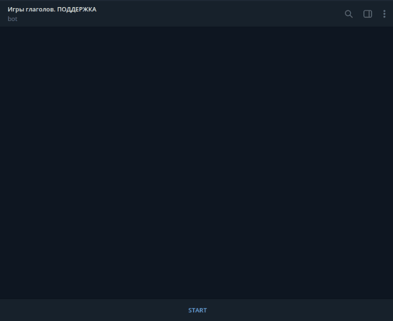

# Verb games support bot
This bot created as a first level techical support.

## How to install
clone repo, get in root dir:
```sh
git clone https://github.com/ilyashirko/verb_games_support_bot && cd verb_games_support_bot
```
create virtual environment and install dependencies (you need poetry 1.2.0 and python 3.8)
```sh
python3 -m venv env && source env/bin/activate && poetry install
```
create `.env` file as in [example](https://github.com/ilyashirko/verb_games_support_bot/blob/master/.env.example).  
`TELEGRAM_BOT_TOKEN` you can get from [@BotFather](https://t.me/BotFather).  
`ADMIN_TELEGRAM_ID` - telegram id of user which would be able to get log messages.  
`VK_BOT_TOKEN` you can get from chapter "working with API" in settings of VK community, where you are administrator.  
`credentials.json` - create [service account](https://console.cloud.google.com/apis/credentials) and put generated credentials into `credentials.json` (you can see example in [credentials.json.example](https://github.com/ilyashirko/verb_games_support_bot/blob/master/credentials.json.example)).  
you should set up a dialogflow api to you project in Google Clouds and get there `GOOGLE_PROJECT_ID`.

## How to learn dialogflow
You need `.json` file with phrases such as [example](https://github.com/ilyashirko/verb_games_support_bot/blob/master/questions.json.example).  
For loading data just launch:
```sh
python3 create_intents -p {path_to_your_json}
```

## How to run
To run both bots:
```sh
python3 telegram_bot.py | python3 vk_bot.py
```

## Telegram bot preview
